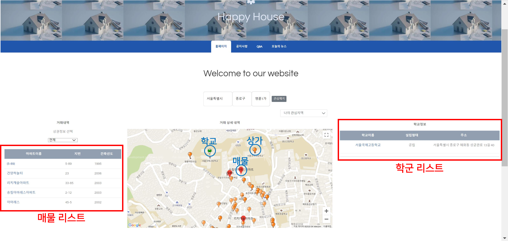
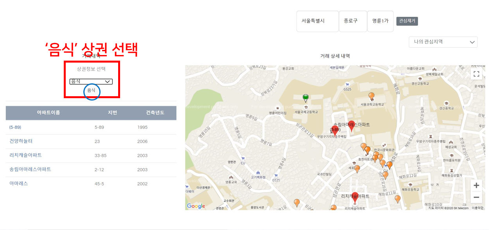
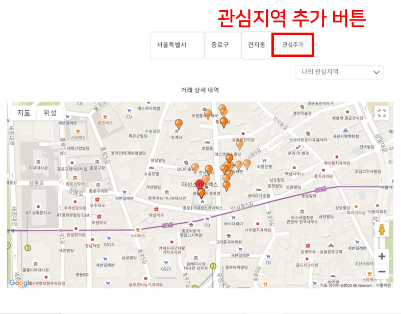

# HappyHouse

> **지역별 부동산 매물 조회 사이트**
>
> **교육과정** : 삼성 청년 SW 아카데미 1학기 과정
>
> **기술스택** : Java, SpringBoot, MySQL
>
> **버전** : 알파버전

### 개요

- **문제 인식**
  - 기존 부동산 매물 조회 사이트(KB 부동산, 네이버 부동산 등) 시장 조사 결과, 서비스가 무겁고 정보가 한눈에 들어오지 않는 문제점 발견
- **해결 방안**
  - 지역별 부동산 매물을 조회하면서 동시에 상권, 학군, 역세권 정보 등 주변 인프라 정보를 지도상에서 확인 가능

### 주요 기능

- **메인화면**

  

  

- **시/구/동 지역 선택 => 매물 조회**

  > **`서울특별시(시) | 종로구(구/군) | 명륜1가`** 검색 결과 

  

  

- **상권 정보 필터링**

  > **`음식`** 상권만 조회

  

  

  > **`음식`, `소매`** 상권 조회

  

- **매물 상세 조회**

  

  

  > 가까운 지하철역 => **`지도보기`** 클릭시 지하철역 위치로 지도 포커싱

  

- **관심지역 리스트**

  

  

- **관심지역 추가**

  

### 결과

- 메인 기능에 집중하고 유저의 관점에서 편의성을 고려함
- 프로젝트 우수상 2등